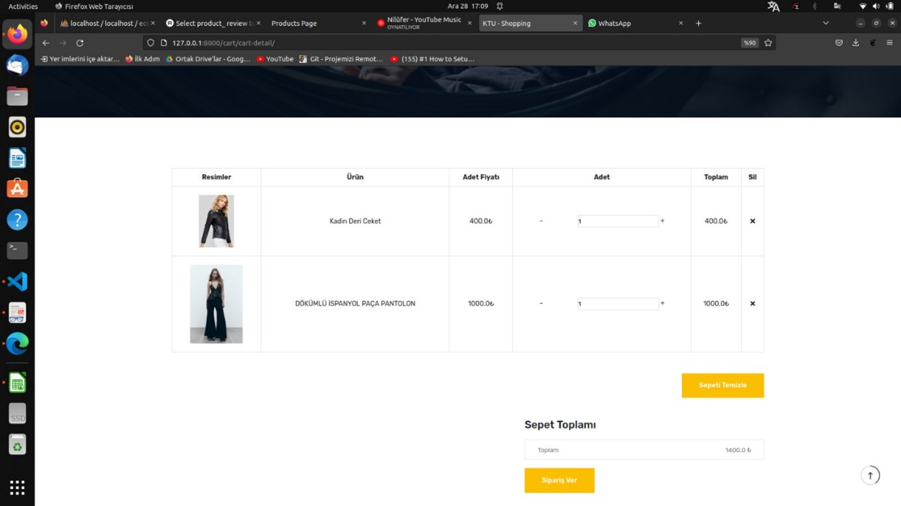

# Electronic Shopping Site

This project is a comprehensive implementation of an electronic shopping site, developed as part of the Database Management course project at Karadeniz Technical University using Django.

## Project Overview

The main objective of this project is to design and implement a database system for an electronic shopping site. The project includes an ER diagram, logical database design, and the creation of the necessary tables in MySQL. Additionally, a user interface for interacting with the database has been developed using Django.

## Features

- **User Authentication:** Users can register, log in, and manage their profiles.
- **Product Management:** Products are categorized and can be filtered by various attributes such as color, size, and category.
- **Order Management:** Users can place orders, manage their cart, and view their order history.
- **Wishlist:** Users can add products to their wishlist for future reference.
- **Return Management:** Users can view and manage their returned products.
- **Admin Panel:** Admins can manage products, view sales statistics, and handle user-specific discounts and rewards.

## Database Design

The database design includes the following entities and their relationships:

- **Entities:** Wallet, Customer, Address, Website User, Order Items, Order Lists, Main Category, Category, Sub Category, Products, Wishlist, Return List, Product Information.
- **Tables:** The database consists of 16 tables, each representing different aspects of the system. The tables include:
  - `s_adress` (id, userid, addressline1, addressline2, city, street, postcode)
  - `user_auth` (id, email, password, last_login, is_superuser, username, firstname, lastname, is_staff, is_active, date_joined)
  - `s_wallet` (id, user_id, card_no, card_name, bank_name, exp_date, ccv)
  - `s_customer` (id, user_id, branch_id, phone, profile, point, discount_rate)
  - `s_order` (id, address_id, wallet_id, user_id, f_name, l_name, phone, amount, date)
  - `s_orderItem` (id, order_id, product_id, user_id, category_id, quantity, price, total)
  - `product` (id, inf_id, cat_id, color_id, size_id, sub_cat_id, name, slug, image, stock, sales, price, discount, in_stock, is_trend)
  - `s_wish_list` (id, product_id, user_id)
  - `s_return_list` (id, user_id, order_item_id, date)
  - `s_information` (id, product_id, specification, detail)
  - `s_product_color` (id, color_code)
  - `s_product_size` (id, size_name)
  - `s_product_review` (id, comment)
  - `s_sub_category` (id, s_category_id, name, slug)
  - `s_category` (id, s_main_cat_id, name, slug)
  - `s_main_category` (id, name, slug)

## User Interface

The user interface includes the following features:

- **Home Page:** Users can search for products by keywords or barcode, and filter products by categories.
- **Profile Management:** Users can update their email, password, and view their order history.
- **Cart and Wishlist:** Users can add products to their cart or wishlist, and manage their orders.
- **Admin Panel:** Admins can view and manage all products, categories, and user information. They can also view sales statistics and manage user-specific discounts and rewards.

## Technology Stack

- **Backend:** Django
- **Database:** MySQL
- **Frontend:** HTML, CSS, JavaScript (for user interactions)

## Usage

To run the project, follow these steps:

1. Clone the repository from GitHub.
2. Set up the database using the provided SQL scripts.
3. Configure the database connection in the Django settings.
4. Run the Django development server:
    \`\`\`bash
    python manage.py runserver
    \`\`\`

## Screenshots
  
  
  
  
  
  
  

## Contributors

- Osman Can Aksoy
- Ufuk Bulut
- Hüdahan Altun

## License

This project is licensed under the MIT License. See the [LICENSE](LICENSE) file for details.
